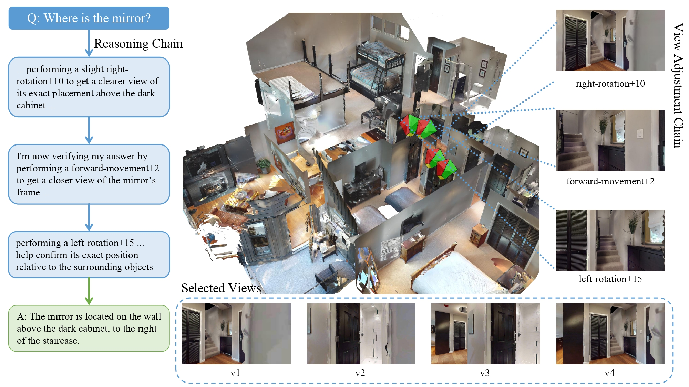

# CoV: Chain-of-View Prompting for Spatial Reasoning

This is the code repository for the paper:
> **CoV: Chain-of-View Prompting for Spatial Reasoning**
>
> [Haoyu Zhao]()\*, [Akide Liu]()\*, [Zeyu Zhang](https://steve-zeyu-zhang.github.io/)\*, [Weijie Wang](https://lhmd.top/)\*, [Feng Chen](), [Ruihan Zhu](), [Gholamreza Haffari]() and [Bohan Zhuang](https://scholar.google.com/citations?user=DFuDBBwAAAAJ&hl=en)†
>
> \*Equal contribution. †Corresponding author.
>
> **[[arXiv]](https://arxiv.org/abs/2601.05172)** **[[Models]](https://huggingface.co/)** **[[HF Paper]](https://huggingface.co/papers/2601.05172)**
> 


## Overview



Embodied question answering (EQA) in 3D environments often requires collecting context that is distributed across multiple viewpoints and partially occluded. However, most recent vision--language models (VLMs) are constrained to a fixed and finite set of input views, which limits their ability to acquire question-relevant context at inference time and hinders complex spatial reasoning. We propose Chain-of-View (CoV) prompting, a training-free, test-time reasoning framework that transforms a VLM into an active viewpoint reasoner through a coarse-to-fine exploration process. CoV first employs a View Selection agent to filter redundant frames and identify question-aligned anchor views. It then performs fine-grained view adjustment by interleaving iterative reasoning with discrete camera actions, obtaining new observations from the underlying 3D scene representation until sufficient context is gathered or a step budget is reached.

## Updates

* 2026-01-09 We release paper on [arXiv](https://arxiv.org/abs/2601.05172).

## Project Structure

```
.
├── cov/                      # Main package
├── scripts/                  # Utility scripts
├── tools/                    # Data processing tools
├── main.py                   # Main entry point
├── pixi.toml                 # Pixi environment configuration
└── README.md
```

## Installation

### Prerequisites

- Python 3.9+
- CUDA support (recommended for HabTat Sim)

### Using Pixi

The project uses [Pixi](https://pixi.sh) for dependency management:

```bash
# Install dependencies
pixi install

# Activate the environment
pixi shell
```

## How to Run

### Setup Environment Variables

Create a `.env` file in the root directory with your API credentials:

```bash
# OpenAI
OPENAI_API_KEY=[your_key_here]

# OpenRouter
OPENROUTER_API_BASE=https://openrouter.api.com/api/v1
OPENROUTER_API_KEY=[your_key_here]

# Dashscop
DASHSCOPE_API_BASE=https://dashscope.aliyuncs.com/compatible-mode/v1
DASHSCOPE_API_KEY=[your_key_here]
```

### Prepare Dataset

1. Download the [OpenEQA](https://open-eqa.github.io/) dataset following the original dataset.
2. Place question files in `data/` directory
3. Place scene frames in `data/frames/` directory

### Run experiment

Run the agent on OpenEQA questions:

```bash
# Specify models.
python main.py model=qwen

# Specify min_action_step
python main.py model=qwen min_action_step=7
```

### Custom Models

You can set your own model backend in [cov/config.py](cov/config.py).


### Output

Results are saved to the configured output directory with:
- JSON files containing answers and metadata
- HTML reports showing navigation history and visualizations
- Screenshots of selected views and bird's eye views

### Run evaluation
For evaluation, please follow the LLM-Match protocol from [OpenEQA](https://open-eqa.github.io/).

## Citation

If you use Chain of View in your research, please cite this work.

```
@article{zhao2026cov,
  title={CoV: Chain-of-View Prompting for Spatial Reasoning},
  author={Zhao, Haoyu and Liu, Akide and Zhang, Zeyu and Wang, Weijie and Chen, Feng and Zhu, Ruihan and Haffari, Gholamreza and Zhuang, Bohan},
  journal={arXiv preprint arXiv:2601.05172},
  year={2026}
}
```
